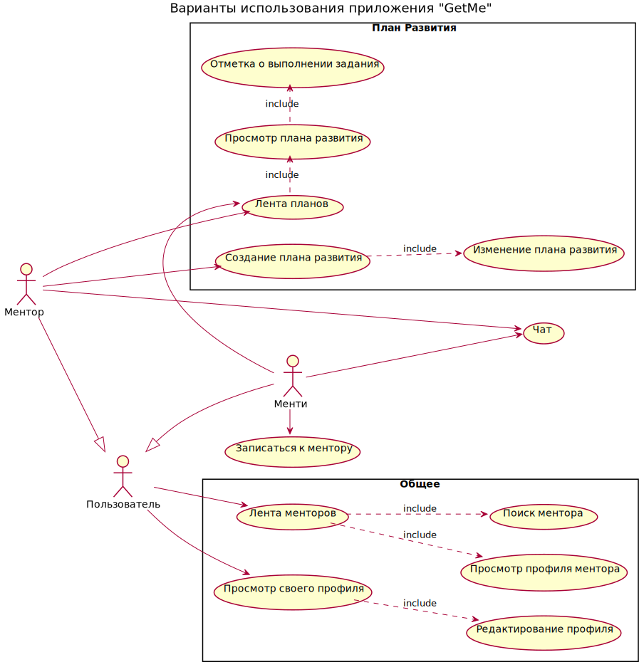
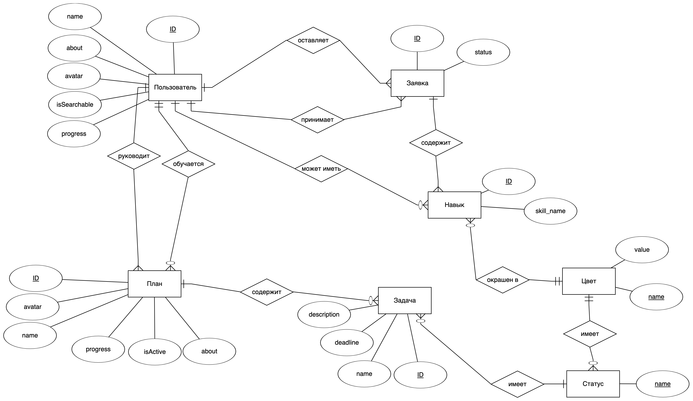
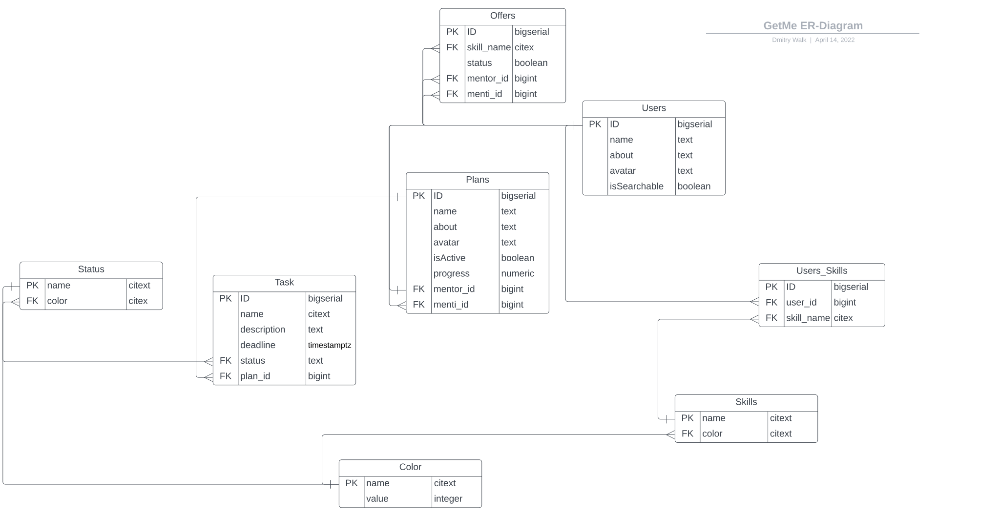

# Приложение для поиска ментора в области информационных технологий

## Описание идеи
**Есть два типа пользователей**: *ментор и менти.*

`Ментор` - разработчик, который работает в индустрии, имеет компетенции в своей области.  
`Менти` - человек, который хочет узнать о работе в компании/получить консультацию/изучить какую-то технологию, профессию под руководством ментора.  

**Есть два варианта взаимодействия**: *платное и бесплатное*  

**Бесплатное:**  
рассказ о работе, получение советов, рекомендаций, составление планов и взаимодействие на безвозмедной основе;

**Платное:**  
спланированная работа с менти(составление плана, отслеживание прогресса);

**Мотивация пользователей:**  
`Ментор`:
- возможность
  - прокачать свой бренд;
  - заработать;
  - лучше разобраться в своих компетенциях;
  - помочь начинающему.

`Менти`:
- возможность
  - изучить технологии, улучшить и углубить имеющиеся навыки;
  - найти единомышленников;
  - обрести новые связи;
  - узнать о вариантах трудоустройства;

## Предметная область
Идею можно отнести к нескольким предметным областям:
  - Образование - получение новых навыков;
  - Общение;
  - Профориентация;

## Архитектурные характеристики  

- База данных - реляционная.
- Язык реализации - `Golang`.
- Стиль взаимодействия - `REST API`.
- `Чистая архитектура`.
- Приложение - `сетевое`, `web-приложение`.

## Диаграммы

### Usecase диаграмма

### ER диаграмма

### ER диаграмма для Базы Данных

